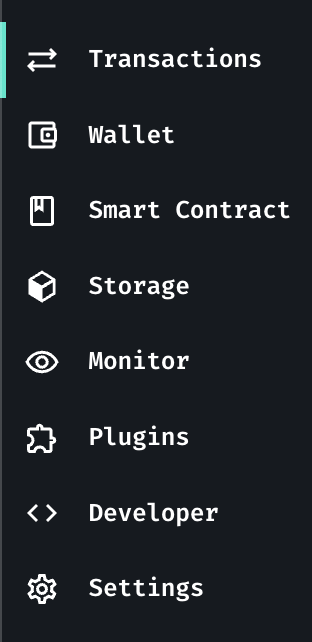
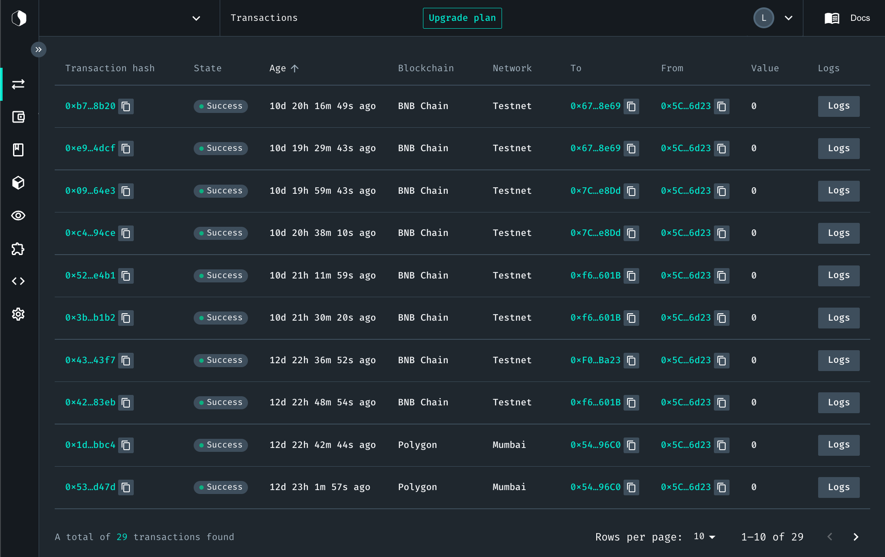

# Discovering the Dashboard

**Starton Dashboard** enables you to access your projects information at a glance.
The **Dashboard** provides you with information on the health and performance of your transactions and watchers.

## Navigating the Dashboard

### Using the Sidebar

The **Dashboard** is organized around Starton services in the **Sidebar**.

By selecting a project, you will access your last transactions.

**Related topics**

- More on [Projects](/Dashboard/create-new-project.md)
- More on [Transactions](/Transactions/understanding-the-relayer.md)
- More on [Developer mode](/Developer/Discovering-coding-interface.md)
