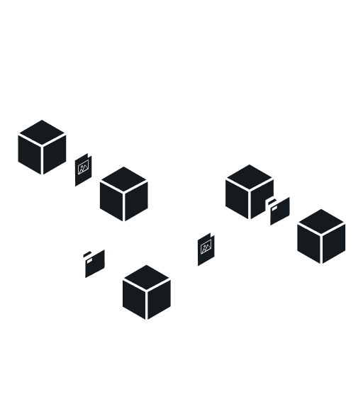

import Tabs from "@theme/Tabs"
import TabItem from "@theme/TabItem"
import CodeBlock from "@theme/CodeBlock"

# Using Storage

You can upload content on IPFS. Starton IPFS is a storage and pinning service, where you can host files, folders, and metadata on our IPFS nodes so that they remain available at all times.



## Uploading Files to IPFS

<Tabs>
<TabItem value="code" label="From Code">

POST requests with a body should have the Content-Type header with value application/json.
For sending files it should be multipart/form-data.

```jsx showLineNumbers
const axios = require("axios")
const FormData = require("form-data")
const fs = require("fs")
// AUTHENTICATING TO THE API USING YOUR API KEY
const startonApi = axios.create({
	baseURL: "https://api.starton.io",
	headers: {
		"x-api-key": "YOUR_API_KEY",
	},
})
// UPLOAD FILE TO IPFS.
const uploadFileToIpfs = async (path, name) => {
	const buffer = fs.readFileSync(path)
	let data = new FormData()

	data.append("file", buffer, name)
	// By setting "isSync" to "true, the request will wait for the pin before completing"
	data.append("isSync", "false")
	// Optional: you can add metadata to your file (object stringified)
	const metadata = JSON.stringify({ your: "additionnal", meta: "data" })
	data.append("metadata", metadata)
	try {
		const ipfsFile = await startonApi.post("/v3/ipfs/file", data, {
			headers: {
				"Content-type": `multipart/form-data; boundary=${data.getBoundary()}`,
			},
		})
		return ipfsFile.data
	} catch (error) {
		console.error(error)
	}
}

// ENTERING YOUR FILE'S INFORMATION
uploadFileToIpfs("./path/of/your/file.png", "name of your file")
	.then((res) => {
		console.log(res)
	})
	.catch((e) => {
		console.log(e)
	})
```

</TabItem>
<TabItem value="dashboard" label="From Dashboard">

1. Go to **Storage**.
1. Click **Upload**.
1. Select File(s).
1. Select content.
1. Enter a name for the file.
1. Click **Upload**.

</TabItem>
</Tabs>

## Uploading JSON Files to IPFS

<Tabs>
<TabItem value="code" label="From Code">

```jsx showLineNumbers
    const axios = require("axios");
    const FormData = require("form-data");
    const fs = require("fs");
    // AUTHENTICATING TO THE API USING YOUR API KEY
    const startonApi = axios.create({
      baseURL: "https://api.starton.io",
      headers: {
        "x-api-key": "YOUR_API_KEY",
      },
    });
    // UPLOAD JSON TO IPFS.
    const uploadJsonToIpfs = async (json, name) => {
    const ipfsJson = await startonApi.post("/v3/ipfs/json", {
      name: name of your json,
      content: json,
      metadata: { your: "additionnal", meta: "data" },
    });
    return ipfsJson;
    };
    // ENTERING YOUR JSON'S INFORMATION
    uploadJsonToIpfs({ "metadata": "data" }, "Json name")
      .then((res) => console.log(res))
      .catch((e) => console.log(e));

```

</TabItem>
<TabItem value="dashboard" label="From Dashboard">

1. Go to **Storage**.
1. Click **Upload**.
1. Select JSON.
1. Select content.
1. Enter a name for the file.
1. Click **Upload**.

</TabItem>
</Tabs>

## Creating folders on IPFS

<Tabs>
<TabItem value="code" label="From Code">

POST requests with a body should have the Content-Type header with value application/json.
For sending files it should be multipart/form-data.

```jsx showLineNumbers
const axios = require("axios")
const FormData = require("form-data")
const fs = require("fs")
// AUTHENTICATING TO THE API USING YOUR API KEY
const startonApi = axios.create({
	baseURL: "https://api.starton.io",
	headers: {
		"x-api-key": "YOUR_API_KEY",
	},
})
// UPLOADING A FOLDER ON IPFS
const uploadFolderToIpfs = async (folderPath, folderName) => {
	let data = new FormData()
	const files = fs.readdirSync(folderPath)

	data.append("folderName", folderName)
	for (const file of files) {
		const buffer = fs.readFileSync(folderPath + "/" + file)
		data.append("files", buffer, file)
	}
	// By setting "isSync" to "true, the request will wait for the pin before completing"
	data.append("isSync", "false")

	// Optional (object stringified)
	const metadata = JSON.stringify({ your: "additionnal", meta: "data" })
	data.append("metadata", metadata)

	// Post data
	try {
		const ipfsFolder = await startonApi.post("/v3/ipfs/folder", data, {
			headers: {
				"Content-type": `multipart/form-data; boundary=${data.getBoundary()}`,
			},
		})
		return ipfsFolder.data
	} catch (error) {
		console.error(error.response.data)
	}
	console.log(data)
}

uploadFolderToIpfs("path/to/your/folder", "Folder name")
	.then((response) => console.log(response))
	.catch((error) => console.log(error))
```

</TabItem>
<TabItem value="dashboard" label="From Dashboard">

1. Go to **IPFS**.
1. Click **Upload**.
1. Select **File(s)**.
1. Toggle the **Create folder** button.
1. Enter **Names** for the files.
1. Click **Upload**.

</TabItem>
</Tabs>

## Pinning CID on IPFS

You can pin content already available on IPFS with Starton using the Content IDentifier (CID).

<Tabs>
<TabItem value="code" label="From Code">
<CodeBlock language="jsx" showLineNumbers>
{`  const axios = require("axios");
    const FormData = require("form-data");
    const fs = require("fs");
    // AUTHENTICATING TO THE API USING YOUR API KEY
    const startonApi = axios.create({
      baseURL: "https://api.starton.io",
      headers: {
        "x-api-key": "YOUR_API_KEY",
      },
    });
    // PINNING A FILE FROM CID
    const pinFromCID = async (cid, name) => {
    const fromCid = await startonApi.post("/v3/ipfs/pin", {
      name: name of the file you would like to pin ,
      cid: cid of the file you would like to pin,
      metadata: { your: "additionnal", meta: "data" },
    });
    return fromCid.data;
  };
  // Enter the information for your file
  pinFromCID(
    "CID of the file",
    "from cid"
  )
    .then((res) => console.log(res))
    .catch((error) => console.log(error))
`}
</CodeBlock>
</TabItem>
<TabItem value="dashboard" label="From Dashboard">

1. Go to **Storage**.
1. Click **Upload**.
1. Select **CID**.
1. Enter the **CID** of the content.
1. Enter a **Name** for the file.
1. Click **Upload**.

</TabItem>
</Tabs>
