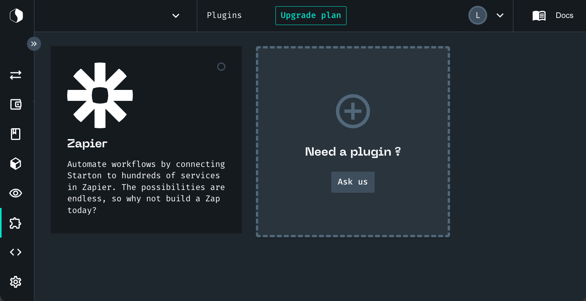

# Understanding Plugins

A plugin is a connection between Starton and an external service.
It is an API call binding that gives you a lot of possibilities.
For example, you can imagine having an integration with Zapier to automatically deploy a smart contract whenever a customer fills an order on your Shopify.
As of now, only the Zapier plugin is available, but we can imagine integrations with messaging apps or Twilio for example.

## Using a Plugin

1. From **Dashboard**, click **Plugins**.
1. Click on a **Plugin**.
1. Follow the integration instructions.

  

**Related topics**

- More on [Transactions](/Transactions/creating-a-transaction.mdx)
- More on [Smart Contracts](/Smart-contract/understanding-smart-contracts.md)
- More on [Developer mode](/Developer/Discovering-coding-interface.md)
