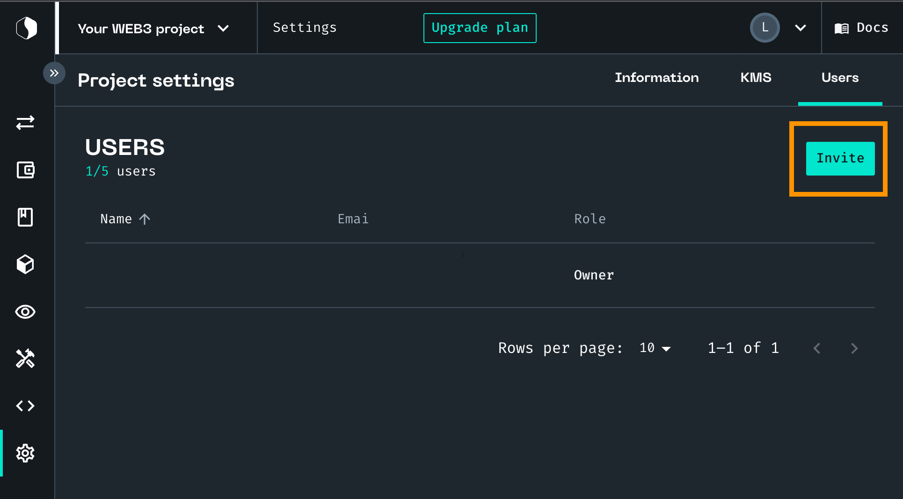

# Managing projects

You can create projects and invite users to work on them with you from the Project list or from the Settings page.

## Creating a new project

1. From **Project List**, click **+**.
1. Enter **New project information**:
    1. Enter a **Name**.
    1. Enter a **Description**.
    1. Pick a color.
1. Click **Confirm**.

## Inviting users to your project 

:::caution PREMIUM FEATURE 

This feature is available only to premium users. To invite new users, contact us to upgrade your plan. 

::: 

1. From **Project settings**, click **Users**. 
   This is where you can see who can collaborate with you on projects. 
1. Click **Invite**. 
   
1. Enter the email of your user. 
   To add several users, click **+ Users**. 
1. Click **Send invitation(s)**. 

## Removing users from your project 

1. From **Project settings**, click **Users**.
   This is where you can see who can collaborate with you on projects.
1. Click **Remove**. 

**Related topics**

-   More on [Transactions](/Transactions/creating-a-transaction.mdx)
-   More on [Smart Contracts](/Smart-contract/understanding-smart-contracts.md)
-   More on [Developer mode](/Developer/Discovering-coding-interface.md)
