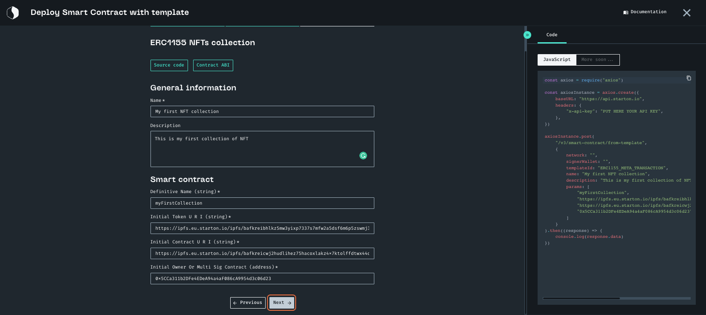
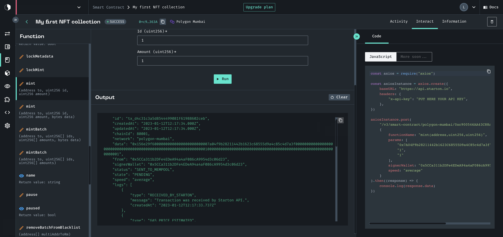

import Tabs from "@theme/Tabs"
import TabItem from "@theme/TabItem"
import CodeBlock from "@theme/CodeBlock"

# How to create a one-to-many NFT collection

If you want to **mint more than one edition of your NFT**, you'll need to create **a smart contract using an ERC1155-flavored template**.

When **minting an NFT collection**, you make **multiple identical editions of the content**. This is one **type of collection**. Multiple digital items will be issued. They will feature **identical content with a different, unique token ID for each NFT**. In this case, you will have **a unique token ID for each digital item** issued with its unique data.

:::note You will need:

-   a **wallet to fund the creation of your contract**
-   the **URI of the metadata of your collection** [Read more](uploading-metadata-NFT).
-   the **URI of the content of the NFT**. You can upload your file on IPFS. [Read more](https://ipfs.eu.starton.io/ipfs/bafkreibhlkz5mw3yixp7337s7mfw2a5dsf6m6p5zswmj3cwlpfavcsyhxe).
-   the **address of the initial owner**
-   the **network on which you want to deploy**

:::

**In this tutorial, we will:**

-   [Deploy the smart contract template for your collection](#deploying-the-smart-contract)
-   [Mint the first NFT of your collection](#minting-the-first-nft-of-your-collection)

## Deploying the smart contract

<Tabs>
<TabItem value="code" label="From Code">

This is where we use the values we've listed earlier:

-   **Name**: "My first NFT collection"
-   **Description**: "This is my first collection of NFT "
-   **Definitive Name**: "myFirstCollection"
-   **Initial Token URI**: the link to the content of your NFT
-   **Initial Contract URI**: the link to the metadata of your contract
-   **Initial Owner of Multi Sig Contract**: The address of the owner of the contract

```jsx showLineNumbers
const axios = require("axios")

const axiosInstance = axios.create({
	baseURL: "https://api.starton.io",
	headers: { "x-api-key": "PUT HERE YOUR API KEY" },
})

axiosInstance
	.post("/v3/smart-contract/from-template", {
		network: "",
		signerWallet: "",
		templateId: "ERC1155_META_TRANSACTION",
		name: "My first NFT collection",
		description: "This is my first collection of NFT ",
		params: [
			"myFirstCollection",
			"", // Initial Token URI
			"", // Initial Contract URI
			"", // Initial Owner of Multi Sig Contract
		],
		speed: "average",
	})
	.then((response) => {
		console.log(response.data)
	})
```

</TabItem>
<TabItem value="dashboard" label="From Dashboard">

### From Dashboard

This is where we use the values we've listed earlier:

-   **Name**: "My first NFT collection"
-   **Description**: "This is my first collection of NFT "
-   **Definitive Name**: "myFirstCollection"
-   **Initial Token URI**: the link to the content of your NFT
-   **Initial Contract URI**: the link to the metadata of your contract
-   **Initial Owner of Multi Sig Contract**: The address of the owner of the contract

1. Click on **Smart Contract**.

    

1. Click **+ Smart contract**.

    

1. Click **Deploy with Template**.
1. Select **Deploy NFTs collections**.
1. Select **ERC1155 NFTs collection**.
1. Enter all of the parameters for your Smart contract.

Here we chose:

-   **Name**: "My first NFT collection"
-   **Description**: "This is my first collection of NFT"
-   **Definitive Name**: "myFirstCollection"
-   **In initial token URI**: the link to the content of your NFT
-   **Initial Contract URI**: the link to the metadata of your contract
-   **Initial Owner of Multi Sig Contract**: The address of the owner of the contract

    

1. Click **Next**.

1. Now select the **Network** on which you want to deploy your contract.

1. Choose the wallet you want to deploy your contract with.

1. Click **Deploy**.
   Here you will define your gas speed. For more, go to gas management.

    

1. Click **Validate** to deploy your contract.

</TabItem>
</Tabs>

<div class="row-is-multiline">

<div class="col col--2" class="cards">
	<a class="button-card button-card--vertical" href="https://app.starton.io/projects">
		<h3>Check your Smart contract on the Dashboard</h3>
		<div class="button-card__inner">
			<p color="white">
				Go to <b>Starton Dashboard</b> and check all the transactions of your smart contract at one glance.
			</p>
		</div>
	</a>
</div>

</div>

## Minting the first NFT of your collection

<Tabs>
<TabItem value="code" label="From Code">

You will need the following information:

-   **Wallet**: the signer wallet
-   **To**: the wallet receiving your NFT
-   **Id**: the identifer of the NFT within the collection
-   **Amount**: amount to mint

```jsx showLineNumbers
    const axios = require("axios")

    const axiosInstance = axios.create({
    baseURL: "
    https://api.starton.io/
    ",
    headers: {
    "x-api-key": "PUT HERE YOUR API KEY",
    },
    })

    axiosInstance.post(
    "/v3/smart-contract/polygon-mumbai/0xc900546AA43C88aBcAF70c20448DF45917c8363A/call",
    {
    functionName: "mint(address,uint256,uint256,bytes)",
    params: [
    "", // the signer wallet
    "", // the receiving wallet
    "1",// the ID
    "1" // the amount
    ],
    signerWallet: "",
    speed: "average"
    }
    ).then((response) => {
    console.log(response.data)
    })

```

</TabItem>
<TabItem value="dashboard" label="From Dashboard">

### From Dashboard

You will need the following information:

-   **Wallet**: the signer wallet
-   **To**: the wallet receiving your NFT
-   **Id**: the identifer of the NFT within the collection
-   **Amount**: amount to mint

1. Click **Interact**.

    

1. In the function list, select **mint**.

    

1. Select the signer wallet.

1. Enter the receiving wallet in the field **to**. Enter the id for your mint. It will be the rank of your NFT in your collection. And finally, enter an amount.

1. Click **Run**.
   

1. Select your Speed and click **Validate**.

    

1. Congratulations! You've minted the first NFT of your collection.

    

</TabItem>
</Tabs>
