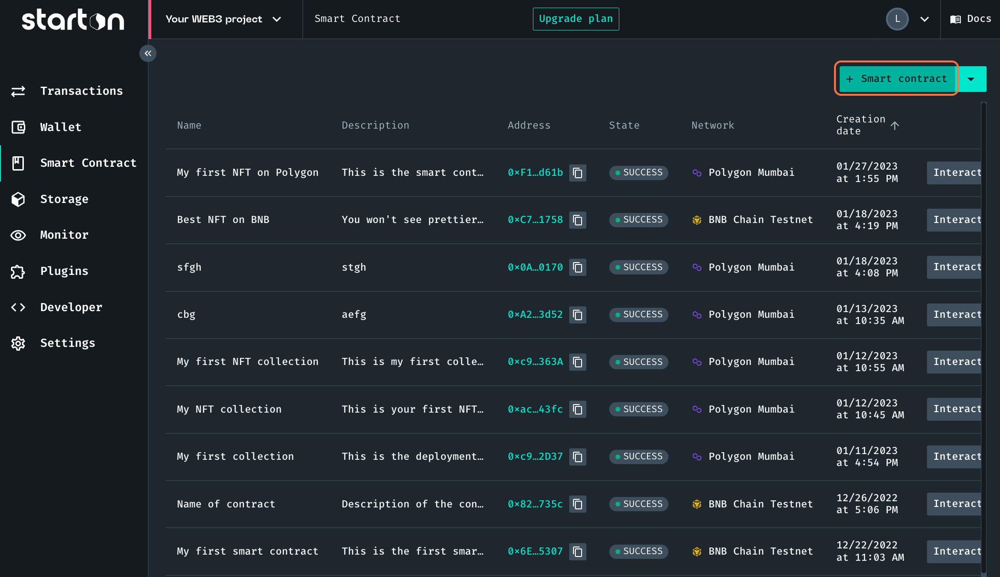
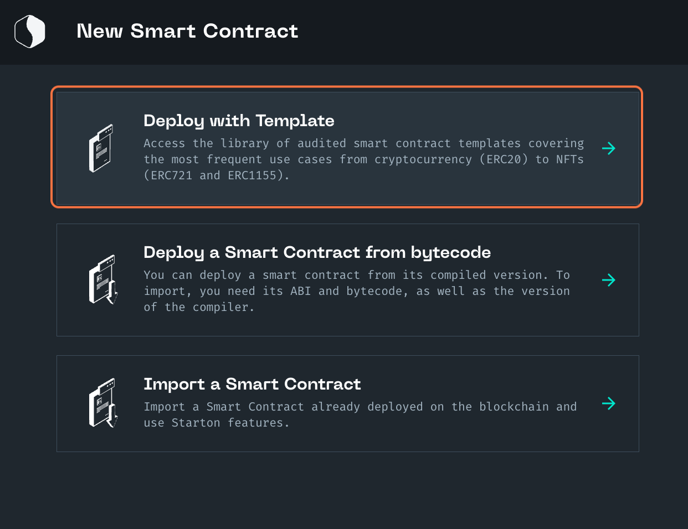
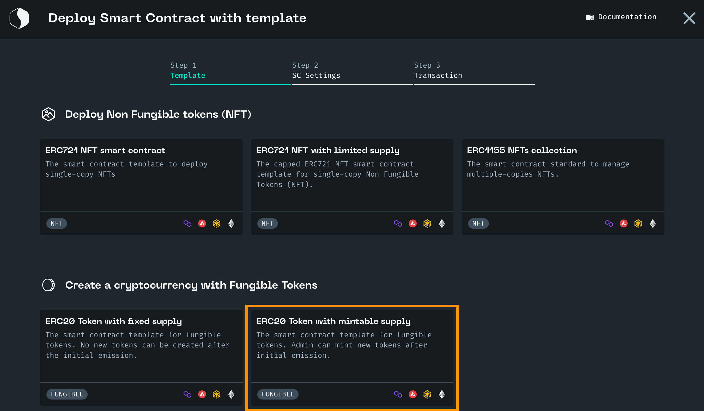
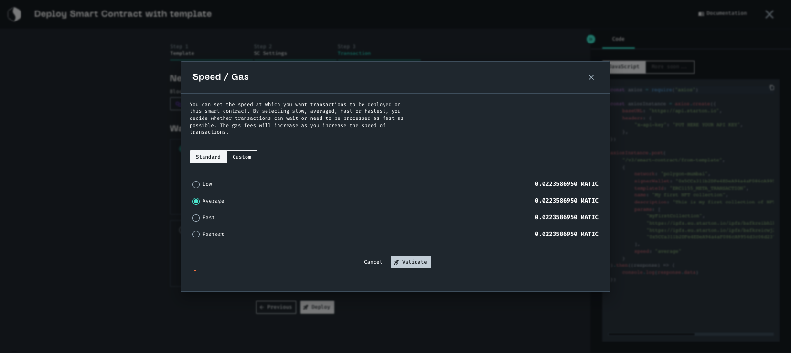
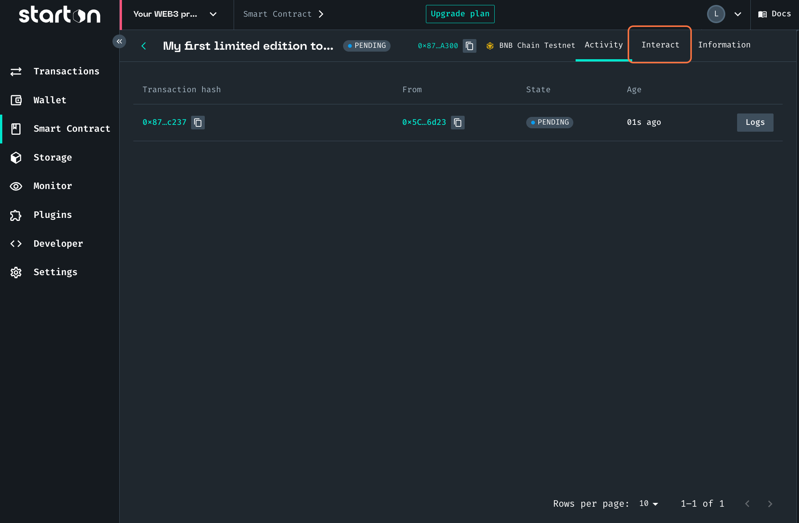

import Tabs from "@theme/Tabs"
import TabItem from "@theme/TabItem"
import CodeBlock from "@theme/CodeBlock"

# How to create your own cryptocurrency (ERC20)

In this tutorial, we will create your own token. The fixed supply version of this standard guarantees no token will ever be created after the initial emission.
Fungible tokens are token from which the value of each token is equal to another.

:::note You will need:

-   **a wallet address with funds:** You can use your default Starton wallet, at creation Starton provides you with faucets.
-   **definitiveName:** The name of your smart contract which will be reflected on-chain.
-   **definitiveSymbol:** The symbol of your smart contract which will be reflected on-chain
-   **initialSupply:** The initial amount of tokens that will be minted.
-   **initialOwnerOrMultisigContract:** The address that will own the ERC20 contract.

:::

**In this tutorial, we will:**

-   [Deploy the smart contract template for your token](#deploying-the-smart-contract)
-   [Process your first token transfer](#minting-the-first-nft-of-your-collection)

## Deploying the Smart contract from our template

<Tabs>
<TabItem value="code" label="From Code">

```jsx showLineNumbers
const axios = require("axios")

const axiosInstance = axios.create({
	baseURL: "https://api.starton.io",
	headers: {
		"x-api-key": "PUT HERE YOUR API KEY",
	},
})

axiosInstance
	.post("/v3/smart-contract/from-template", {
		network: "", // The blockchain network on which you want to deploy your smart contract
		signerWallet: "", // The address of the signer wallet
		templateId: "ERC20_MINT_META_TRANSACTION",
		name: "", // The name of the contract on Starton
		description: "", // The description of the contract on Starton
		params: [
			"", // The name of your smart contract which will be reflected on-chain.
			"", //  The symbol of your smart contract which will be reflected on-chain
			"", // The total amount of tokens that will ever be minted.
			"", // The address that will own the ERC20 contract.
		],
	})
	.then((response) => {
		console.log(response.data)
	})
```

</TabItem>
<TabItem value="dashboard" label="From Dashboard">

### From Dashboard

1. Click on **Smart Contract**.

    

1. Click **+ Smart contract**.

1. Click **Deploy with Template**.

    

1. Click **Create a cryptocurrency with Fungible Tokens**, click **ERC20 Token with mintable supply**.

    

1. In **General information**, enter **a name and a description** for your smart contract. These will appear only on Starton and can be edited after creation.
1. In **Smart contract**, enter:

-   **definitiveName:** The name of your smart contract which will be reflected on-chain. For example,"MyFirstToken".
-   **definitiveSymbol:** The symbol of your smart contract which will be reflected on-chain. For example, "MFT".
-   **initialSupply:** The initial amount of tokens that will be minted. For example, "100000000000000000000000000000000000000".
-   **initialOwnerOrMultisigContract:** The address that will own the ERC20 contract. For example, your default Starton wallet.

    

1. Click on **Next**.

1. Now select the network on which you want to deploy your contract.

    

1. Choose the wallet you want to deploy your contract with.

1. Click **Deploy**.
   Here you will define your gas speed. For more, go to gas management.

    

1. Click **Validate** to deploy your contract.

</TabItem>
</Tabs>

Congrats on deploying your smart contract.

<div class="row-is-multiline">

<div class="col col--2" class="cards">
	<a class="button-card button-card--vertical" href="https://app.starton.io/projects">
		<h3>Check your Smart contract on the Dashboard</h3>
		<div class="button-card__inner">
			<p color="white">
				Go to <b>Starton Dashboard</b> and check all the transactions of your smart contract at one glance.
			</p>
		</div>
	</a>
</div>

</div>

## Process your first token transfer

<Tabs>
<TabItem value="code" label="From Code">

You will need the following information:

-   **Wallet**: the signer wallet
-   **To**: the wallet receiving your transfer
-   **Amount**: amount to transfer

```jsx showLineNumbers
const axios = require("axios")

const axiosInstance = axios.create({
	baseURL: "https://api.starton.io",
	headers: {
		"x-api-key": "PUT HERE YOUR API KEY",
	},
})

axiosInstance
	.post("/v3/smart-contract/YOUR_SMART_CONTRACT_NETWORK/YOUR_SMART_CONTRACT_ADDRESS/call", {
		functionName: "transfer(address,uint256)",
		params: [
			"", // Enter the wallet receiving tokens.
			"", //amount of token transferred
		],
		signerWallet: "", // Enter the wallet from which tokens will be transferred.
		speed: "average",
	})
	.then((response) => {
		console.log(response.data)
	})
```

</TabItem>
<TabItem value="dashboard" label="From Dashboard">

### From Dashboard

You will need the following information:

-   **Wallet**: the signer wallet
-   **To**: the wallet receiving your transfer
-   **Amount**: amount to transfer

1. Click **Interact**.

    

1. In the function list, select **transfer**.

    

1. Select the signer wallet.

1. Enter the receiving wallet in the field **to**. And finally, enter an amount to transfer.

1. Click **Run**.

    

1. Select your Speed and click **Validate**.

</TabItem>
</Tabs>

Congratulations! You've transferred your first token.
