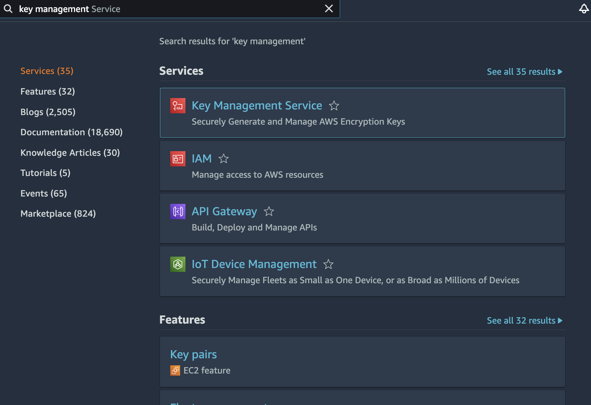

# Granting access to a specific wallet to Starton Identity and Access Management

In this tutorial, you will learn how to connect an **AWS Key Management System (KMS)** to **Starton**.

> **Starton** provides test wallets hosted on our **Key Management System**, but when going in production, to maintain control over your wallets, you should use your own KMS.

To connect **Starton** to your **AWS KMS**, you can grant access to **Starton** only to one wallet of your **KMS**. You can also [grant full access to **Starton** on your **KMS**](grantfull-access.md). 

> By granting access to **Starton** only to one wallet, you’ll have to create new wallets and import them every time on your own.

### Creating a wallet on AWS

1. On your AWS dashboard, search **Key Management Service**.
   
   You access a listing of your existing keys.

    > A key is an equivalent to a wallet in this use case.

1. Click **Create a key**.
1. Set up your key:
   
    1. In **Key type**, select **Asymmetric**.
    1. In **Key usage**, select **Sign and verify**.
    1. In **Key spec**, select **ECC_SECG-P256K1**.
    1. In **Advanced options**, select **Multi-region key**.
1. Click **Next**.
1. In **Alias**, enter a name for your key.
1. Skip step 3 **Define key administrative permissions**.
1. In step 4 **Define key usage permissions**, in **Other AWS account**, enter Starton information:
    1. In arn:aws:iam::, enter `052805596453`.
       

### Connecting your wallet on Starton

1. From the **Dashboard**, go to **Wallets**.
1. Click **+ Wallet**.
1. Select **Connect a single Wallet from a Key Management System**.
1. Enter a **Wallet name**.
1. Enter a **Description**.
1. Enter the **Key ARN**. You will find it on AWS in the **General Configuration** panel following a `arn:aws:kms:eu-west-3:XXXXXXXXXXXX:key/mrk-XXXXXXXXXXXXXXXXXXXXXXXXXXXXXXXX`format.

**Related topics**

-   More on [Transactions](/Transactions/creating-a-transaction.mdx)
-   More on [Smart Contracts](/Smart-contract/understanding-smart-contracts.md)
-   More on [Developer mode](/Developer/Discovering-coding-interface.md)
