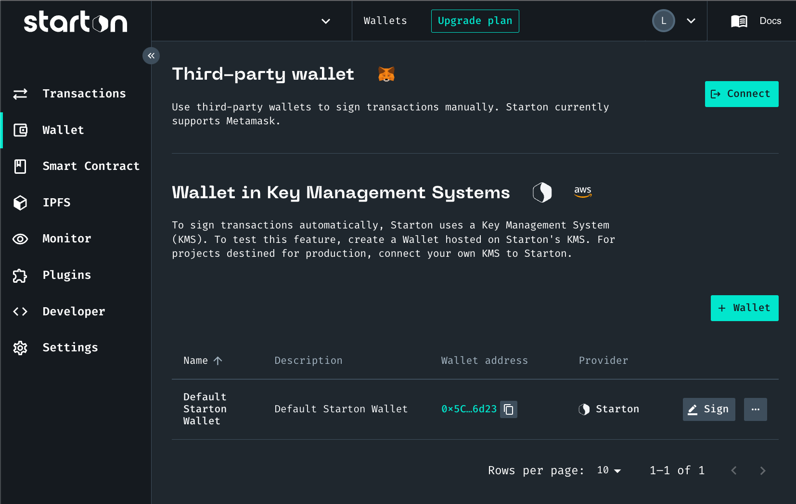
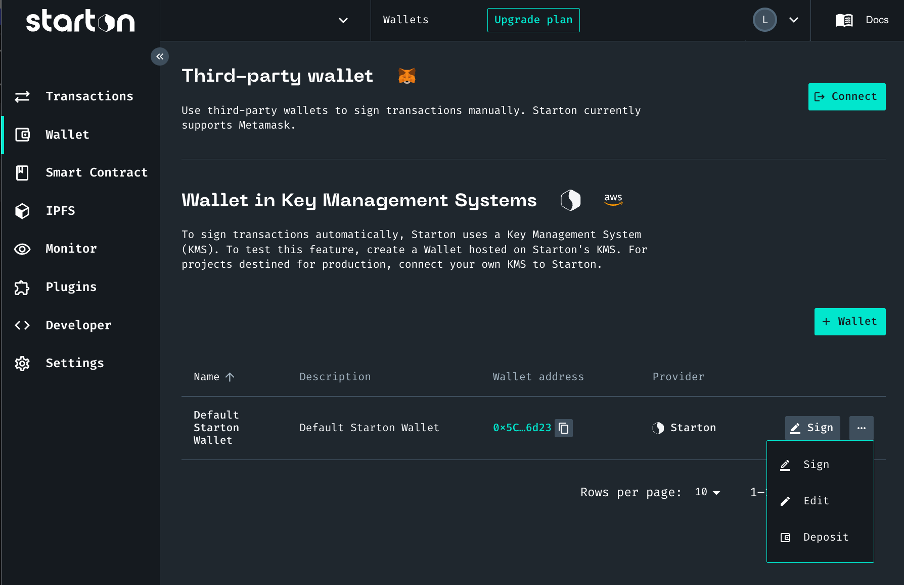

import threePoints from "./assets/three-points.png"
import signMessage from "./assets/sign-a-message.png"
import Tabs from "@theme/Tabs"
import TabItem from "@theme/TabItem"
import CodeBlock from "@theme/CodeBlock"

# Creating a wallet on KMS

When deploying and interacting with **Smart Contracts**, you can create a wallet on KMS to sign transactions.

:::caution

Do not use wallets on Starton KMS for production.

:::



<Tabs>{/*
<TabItem value="code" label="From Code">

```jsx showLineNumbers
const axios = require("axios")

// AUTHENTICATING TO THE API USING YOUR API KEY
const startonApi = axios.create({
	baseURL: "https://api.starton.io",
	headers: {
		"x-api-key": "YOUR_API_KEY",
	},
})

// CREATING A WALLET
const createWallet = async (name, description, credentials) => {
	try {
		return await startonApi.post("/v3/kms/wallet", {
			name,
			description,
			credentials,
		})
	} catch (error) {
		console.log(error.response.data)
	}
}

createWallet("Your wallet name", "This is the description of your wallet", {
	accountId: "string", // The 12 digit number you can find it in the top-right corner of your AWS Dashboard.
	accessKeyId: "string", // The Access Key ID of the new IAM user available after completing (lien vers step new user).
	secretAccessKey: "string", // The Secret access key of the new IAM user available after completing .
	region: "string",
}).then((data) => console.log(data))
```

</TabItem> */}
<TabItem value="dashboard" label="From Dashboard">

1. From **Dashboard**, go to **Wallet**.
1. Click **Add a wallet**.
1. Select a type of wallet:
    - **Create a wallet on Starton's Key Management System** enables you to deploy and interact with Smart Contracts on testnets.
    - **Connect a single Wallet from a Key Management System** enables you to set up a wallet to sign transactions automatically.
    - **Connect your KMS and grand full access to Starton** enables you to use multiple wallets for advanced projects.
1. Enter a **Name** and a **Description** for your wallet.

</TabItem>
</Tabs>

You can now use your wallet.

:::info

When creating a wallet on KMS, **Starton** provides you with faucets to help you with your first transactions on the following networks: binance-testnet, polygon-mumbai, avalanche-fuji.

:::

## Editing a Wallet



<Tabs>
<TabItem value="code" label="From Code">

You can edit a the name or description of your wallet.

```jsx showLineNumbers
const axios = require("axios")
// AUTHENTICATING TO THE API USING YOUR API KEY
const startonApi = axios.create({
	baseURL: "https://api.starton.io",
	headers: {
		"x-api-key": "YOUR_API_KEY",
	},
})

// EDITING A WALLET
const editWallet = async (name, description) => {
	try {
		return await startonApi.post("/v3/kms/wallet/{address}", {
			name,
			description,
		})
	} catch (error) {
		console.log(error.response.data)
	}
}

editWallet("Your wallet", "This is my renamed wallet").then((data) => console.log(data))
```

</TabItem>
<TabItem value="dashboard" label="From Dashboard">

You can edit a the name or description of your wallet.

1. Click .
1. Click **Edit**.
1. Change your wallet name or description.
1. Click **Save**.

Your wallet has been edited.

</TabItem>
</Tabs>

## Making a Deposit on a Wallet

To send transactions, you need a sufficient balance on your wallet.

<Tabs>
<TabItem value="code" label="From Code">

To transfer tokens to your wallet, you can make a transfer using transactions to your wallet.

```jsx showLineNumbers
const axios = require("axios")
// AUTHENTICATING TO THE API USING YOUR API KEY
const startonApi = axios.create({
	baseURL: "https://api.starton.io",
	headers: {
		"x-api-key": "YOUR_API_KEY",
	},
})

const createTx = async (value, to, signerWallet, network) => {
	try {
		return await startonApi.post("/v3/transaction", {
			value,
			to, // receiving wallet
			signerWallet, // sender wallet
			network,
		})
	} catch (error) {
		console.log(error.response.data)
	}
}
createTx(
	"0",
	"0x694F07CEEc0869aa0dB5E8157FA538268F28B23f",
	"0x694F07CEEc0869aa0dB5E8157FA538268F28B23f",
	"binance-testnet",
)
	.then((response) => console.log(response))
	.catch((error) => console.log(error))
```

</TabItem>
<TabItem value="dashboard" label="From Dashboard">

To transfer tokens to your wallet, access the address of your wallet in deposit.

1. Click .
1. Click **Deposit**.
1. Copy the address of your wallet.
   This is the address you need to fill as recipient when transferring currency for example from a third-party wallet.
1. Click **Close**.

</TabItem>
</Tabs>

## Signing a message with a Wallet


They are used to prove ownership of an address without exposing its private key. This is primarily used for signing transactions but can also be used to sign arbitrary messages.

:::caution

After a message is signed, the message and the signature cannot be modified and thus message authentication and integrity is guaranteed. Anyone, who knows the public key of the message signer, can verify the signature.

:::

<Tabs>
<TabItem value="code" label="From Code">

```jsx showLineNumbers
const axios = require("axios")
// AUTHENTICATING TO THE API USING YOUR API KEY
const startonApi = axios.create({
	baseURL: "https://api.starton.io",
	headers: {
		"x-api-key": "YOUR_API_KEY",
	},
})

// SIGNING A MESSAGE
const signMessage = async (address, message) => {
	try {
		return await startonApi.post(`/v3/kms/wallet/${address}/sign-message`, {
			message, // The message you want to sign with the address required in the route.
		})
	} catch (error) {
		console.log(error.response.data)
	}
}

signMessage("0x", "Hello, World!")
	.then((response) => console.log(response))
	.catch((error) => console.log(error))
```

</TabItem>
<TabItem value="dashboard" label="From Dashboard">

1. Click .
1. Click **Sign**.
1. Enter your message.
1. Click **Submit**.

After loading, your signature appears.

</TabItem>
</Tabs>
