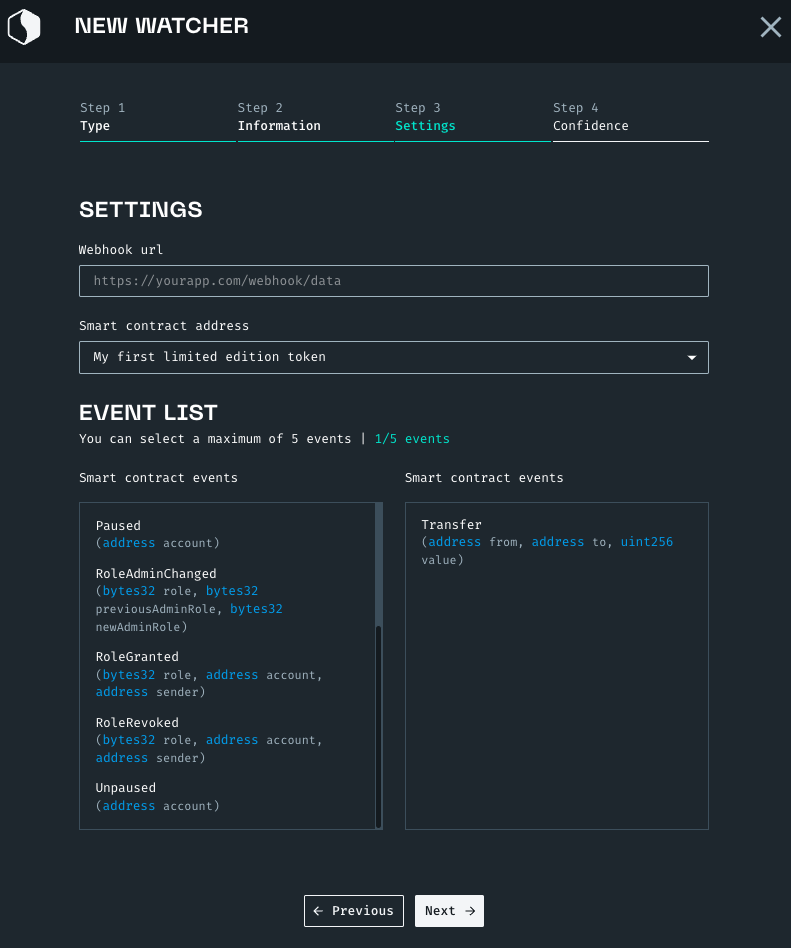

import GitHubLogo from "./src/confirmationblock.png"
import Tabs from "@theme/Tabs"
import TabItem from "@theme/TabItem"
import CodeBlock from "@theme/CodeBlock"

# Creating a watcher

## Creating a watcher from an available event type

You can create a watcher to monitor blockchain event.

<Tabs>
<TabItem value="code" label="From Code">
To create a watcher from the code of you application, use the following snippet.
You can find the full list of networks and event types in our <a href="https://docs.starton.com/intro#tag/Watcher/operation/WatcherCreateOne">API reference</a>.

<CodeBlock language="jsx" showLineNumbers>
{`const axios = require("axios");
// First, authenticate to the API
const startonApi = axios.create({
  baseURL: "https://api.starton.com",
  headers: {
    "x-api-key": "YOUR_API_KEY",
  },
});
// Use the watcher creation endpoint
startonApi.post(
    "/v3/watcher",
    {
        name: "Name of your watcher", // Enter a name for your watcher
        description: "Describe your watcher", // Enter a description for your watcher
        address: "0x000000000000", // Enter the address to watch (either a wallet or a smart contract)
        network: "polygon-mumbai",// Enter a network, you can find the list of networks available in our API reference.
        type: "ADDRESS_ACTIVITY",// Select an event type
        webhookUrl: "https://xxxxxxx/", // Enter the address of the webhook
        confirmationsBlocks: 50 // Depending on your needs, select the number of confirmed blocks before an event triggers your watcher
    }
).then((response) => {
    console.log(response.data)
})`}
</CodeBlock>
</TabItem>
<TabItem value="dashboard" label="From Webapp">

1. From **Dashboard**, go to **Watcher**.
1. Click **+ Watcher**.
1. Enter a **Name** and **Description**.
1. Click **Next**.
1. Select a type of notification.
1. Fill in the **Settings**.
   
1. In **Construction**:
    1. Select a **Blockchain**.
    1. Select a **Network**.
    1. Enter an address
    1. Enter a webhook URL.
1. In **Confirmation blocks**, enter a number.
    
1. Click **Create**.

</TabItem>
</Tabs>

## Creating a watcher from a custom event type

You can create a watcher to monitor blockchain event.

<Tabs>
<TabItem value="code" label="From Code">
To create a watcher from the code of you application, use the following snippet.
You can find the full list of networks and event types in our <a href="https://docs.starton.com/intro#tag/Watcher/operation/WatcherCreateOne">API reference</a>.

<CodeBlock language="jsx" showLineNumbers>
{`const axios = require("axios");
// First, authenticate to the API
const startonApi = axios.create({
  baseURL: "https://api.starton.com",
  headers: {
    "x-api-key": "YOUR_API_KEY",
  },
});
// Use the watcher creation endpoint
startonApi.post(
    "/v3/watcher",
    {
        name: "Name of your watcher", // Enter a name for your watcher
        description: "Describe your watcher", // Enter a description for your watcher
        address: "0x000000000000", // Enter the address to watch (either a wallet or a smart contract)
        network: "polygon-mumbai",// Enter a network, you can find the list of networks available in our API reference.
        type: "EVENT_CUSTOM",// Select an event type
        customEventAbi: {},// Here you will specify the event you want to monitor from the ABI of your contract. 
        webhookUrl: "https://xxxxxxx/", // Enter the address of the webhook
        confirmationsBlocks: 50 // Depending on your needs, select the number of confirmed blocks before an event triggers your watcher
    }
).then((response) => {
    console.log(response.data)
})`}
</CodeBlock>
</TabItem>
<TabItem value="dashboard" label="From Webapp">

1. From **Dashboard**, go to **Watcher**.
1. Click **+ Watcher**.
1. Enter a **Name** and **Description**.
1. Click **Next**.
1. Select CUSTOM EVENT.
1. Fill in the **Settings**.
   
1. In **Construction**:
   1. Select a **Blockchain**.
   1. Select a **Network**.
   1. Enter an address
   1. Enter a webhook URL.
1. In **Confirmation blocks**, enter a number.
   
1. Click **Create**.

</TabItem>
</Tabs>

## Watcher states and status

From **Dashboard**, click **Monitor** to access your list of watchers.

In the **State** column, information is displayed to help you understand what's happening to your watcher.

### States

A watcher can either be **Running** or **Paused**.

When **Paused**, a status enables you to understand how to solve the issue.

### Paused Status

| State                  | Description                                                                                    |
| ---------------------- | ---------------------------------------------------------------------------------------------- |
| Lack of ressources     | The limit of your plan has been reached. Please contact us to upgrade and restart the watcher. |
| Webhook not responding | The webhook set up for this watcher is not responding.                                         |
| Paused by user         | The watcher has been paused by a user. You can resume the watcher.                             |

**Related topics**

-   More on [Transactions](/Transactions/creating-a-transaction.mdx)
-   More on [Smart Contracts](/Smart-contract/understanding-smart-contracts.md)
-   More on [Developer mode](/Developer/Discovering-coding-interface.md)
