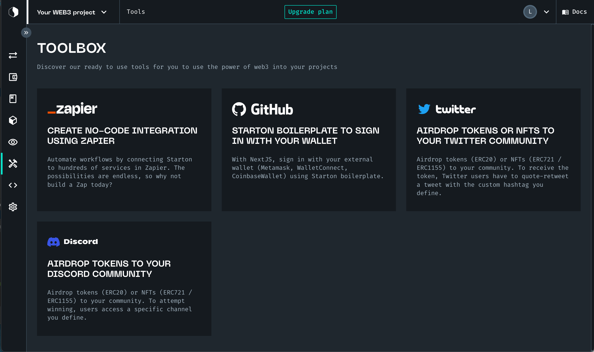

# Understanding Tools

A tool is a connection between Starton and an external service.

For example, you can imagine having an integration with Zapier to automatically deploy a smart contract whenever a customer fills an order on your Shopify.

In the toolbox, several tools are available. Starton provides you with a Zapier integration, social medial bots or other Github repositories to help you build your application. 

## Using a Tool 

1. From **Dashboard**, click **Tools**.
1. Click on a **Tool**.
1. Follow the integration instructions.

## Available tools 

<a href="https://zapier.com/app/login?next=%2Fdeveloper%2Fpublic-invite%2F122867%2Fcc4c6dd705e4216b45be9f004b155131%2F"><h3>Zapier</h3>

Create no-code integration using Zapier

</a>

<a href="https://github.com/starton-io/boilerplate-sign-in-with-wallets-next-js"><h3>Starton Boilerplate</h3>

With NextJS, sign in with your external wallet using our boilerplate.

</a>

<a href="https://github.com/starton-io/twitter-airdrop-bot"><h3>Twitter</h3>

Airdrop tokens or NFTs to your twitter community.

</a>

<a href="https://github.com/starton-io/discord-airdrop-bot"><h3>Discord</h3>

Airdrop tokens to your discord community.

</a>

**Related topics**

-   More on [Tracking wallet activity with Zapier](/Tutorials/track-wallet-activity.md)
-   More on [Understanding smart contracts](/Smart-contract/understanding-smart-contracts.md)
-   More on [Developer mode](/Developer/Discovering-coding-interface.md)
